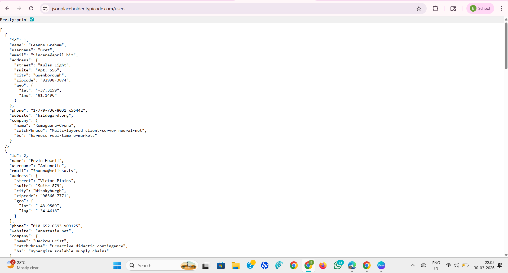

# Task 3 – API Security Risk Analysis

## Objective
The objective of this task is to analyze the security of a public API and identify potential risks such as data exposure, lack of authentication, and improper access control.

---

## Tools Used
- Browser (Google Chrome)
- Browser Developer Tools
- Public API (JSONPlaceholder)
- Manual Security Analysis

---

## Target API
https://jsonplaceholder.typicode.com/users

---

## API Testing Overview

The API was tested by sending HTTP GET requests through the browser.

### Sample Request
GET /users

### Response
The API returned user data in JSON format, including:
- Name  
- Username  
- Email  
- Address  
- Phone number  
- Company details  

---

## Identified Security Risks

---

### 🔴 Risk 1 – Excessive Data Exposure

**Risk Level:** High  

**Description:**  
The API exposes detailed user information such as address, phone number, and company data without restriction.

**Impact:**
- Leakage of sensitive user data  
- Privacy issues  
- Data misuse  

**Recommendation:**
- Limit data returned by API  
- Use data filtering  
- Follow least privilege principle  

---

### 🔴 Risk 2 – No Authentication Required

**Risk Level:** High  

**Description:**  
The API allows access without login or API key.

**Impact:**
- Anyone can access data  
- Unauthorized data access  
- Data scraping  

**Recommendation:**
- Implement authentication (API keys / JWT / OAuth)  
- Restrict access  

---

### 🟠 Risk 3 – Lack of Authorization

**Risk Level:** Medium  

**Description:**  
No control over who can access specific data.

**Impact:**
- Unauthorized data access  

**Recommendation:**
- Use role-based access control (RBAC)  

---

### 🟡 Risk 4 – No Rate Limiting

**Risk Level:** Medium  

**Description:**  
Unlimited API requests are allowed.

**Impact:**
- Server overload  
- Abuse / DoS attacks  

**Recommendation:**
- Implement rate limiting  

---

### 🟡 Risk 5 – Lack of Input Validation

**Risk Level:** Low  

**Description:**  
Inputs are not strictly validated.

**Impact:**
- Possible injection risks  

**Recommendation:**
- Validate and sanitize inputs  

---

## Evidence (Screenshot)

The screenshot below shows API response exposing user data without authentication.

---

## Attack Scenario

1. Attacker accesses the API  
2. No authentication required  
3. Data is retrieved easily  
4. Data can be misused  

---

## Prevention Strategies

### For Developers
- Implement authentication  
- Limit data exposure  
- Apply rate limiting  
- Validate inputs  

### For Organizations
- Monitor API traffic  
- Use API gateways  
- Perform regular security testing  

---

## Learning Outcome

This task helped in understanding API security risks such as data exposure, lack of authentication, and improper access control.

---

## Conclusion

The API contains security risks like excessive data exposure and lack of authentication. Implementing proper security controls can improve API security and prevent misuse.
